# ERCS Experiment Report
## Emergency Response Coordination Simulator
### Adaptive vs Baseline Coordination Under Intermittent Connectivity

MSc Computer Science — University of Liverpool, 2026

This notebook runs the complete ERCS experiment and produces publication-quality
visualizations and statistical analysis for the dissertation.


```python
import sys
import time
from pathlib import Path

import matplotlib.pyplot as plt
import numpy as np
import pandas as pd

# Ensure src is on the path
project_root = Path.cwd().parent if Path.cwd().name == "notebooks" else Path.cwd()
sys.path.insert(0, str(project_root / "src"))

from ercs.config.parameters import AlgorithmType, SimulationConfig
from ercs.evaluation.metrics import MetricType, PerformanceEvaluator
from ercs.simulation.engine import ExperimentRunner
from ercs.visualization.plots import (
    METRICS_CONFIG,
    apply_thesis_style,
    build_anova_table,
    build_parameter_tables,
    build_results_dataframe,
    build_ttest_table,
    compute_summary_stats,
    plot_box_distributions,
    plot_degradation_lines,
    plot_grouped_bars,
    plot_heatmap,
    save_figure,
)

apply_thesis_style()
FIGURES_DIR = project_root / "outputs" / "figures"
FIGURES_DIR.mkdir(parents=True, exist_ok=True)

print("Setup complete.")
```

    Setup complete.


## 1. Experiment Parameters

All parameters are sourced from published literature and configured
in `configs/default.yaml`.


```python
config = SimulationConfig()

tables = build_parameter_tables(config)
for name, table_df in tables.items():
    print(f"\n{'=' * 60}")
    print(f"  {name}")
    print(f"{'=' * 60}")
    display(table_df.style.hide(axis="index"))
```

    
    ============================================================
      Network Topology
    ============================================================


<style type="text/css">
</style>
<table id="T_c5b1d">
  <thead>
    <tr>
      <th id="T_c5b1d_level0_col0" class="col_heading level0 col0" >Parameter</th>
      <th id="T_c5b1d_level0_col1" class="col_heading level0 col1" >Value</th>
      <th id="T_c5b1d_level0_col2" class="col_heading level0 col2" >Source</th>
    </tr>
  </thead>
  <tbody>
    <tr>
      <td id="T_c5b1d_row0_col0" class="data row0 col0" >Node count</td>
      <td id="T_c5b1d_row0_col1" class="data row0 col1" >50 (2 coordination + 48 mobile)</td>
      <td id="T_c5b1d_row0_col2" class="data row0 col2" >Ullah & Qayyum (2022)</td>
    </tr>
    <tr>
      <td id="T_c5b1d_row1_col0" class="data row1 col0" >Simulation area</td>
      <td id="T_c5b1d_row1_col1" class="data row1 col1" >3000 x 1500 m²</td>
      <td id="T_c5b1d_row1_col2" class="data row1 col2" >Ullah & Qayyum (2022)</td>
    </tr>
    <tr>
      <td id="T_c5b1d_row2_col0" class="data row2 col0" >Incident zone</td>
      <td id="T_c5b1d_row2_col1" class="data row2 col1" >700 x 600 m²</td>
      <td id="T_c5b1d_row2_col2" class="data row2 col2" >Ullah & Qayyum (2022)</td>
    </tr>
    <tr>
      <td id="T_c5b1d_row3_col0" class="data row3 col0" >Radio range</td>
      <td id="T_c5b1d_row3_col1" class="data row3 col1" >100 m</td>
      <td id="T_c5b1d_row3_col2" class="data row3 col2" >Ullah & Qayyum (2022)</td>
    </tr>
    <tr>
      <td id="T_c5b1d_row4_col0" class="data row4 col0" >Buffer size</td>
      <td id="T_c5b1d_row4_col1" class="data row4 col1" >25 MB</td>
      <td id="T_c5b1d_row4_col2" class="data row4 col2" >Ullah & Qayyum (2022)</td>
    </tr>
    <tr>
      <td id="T_c5b1d_row5_col0" class="data row5 col0" >Message size</td>
      <td id="T_c5b1d_row5_col1" class="data row5 col1" >512 kB</td>
      <td id="T_c5b1d_row5_col2" class="data row5 col2" >Kumar et al. (2023)</td>
    </tr>
    <tr>
      <td id="T_c5b1d_row6_col0" class="data row6 col0" >Connectivity scenarios</td>
      <td id="T_c5b1d_row6_col1" class="data row6 col1" >75%, 40%, 20%</td>
      <td id="T_c5b1d_row6_col2" class="data row6 col2" >Karaman et al. (2026)</td>
    </tr>
    <tr>
      <td id="T_c5b1d_row7_col0" class="data row7 col0" >Mobility model</td>
      <td id="T_c5b1d_row7_col1" class="data row7 col1" >Random Waypoint</td>
      <td id="T_c5b1d_row7_col2" class="data row7 col2" >Ullah & Qayyum (2022)</td>
    </tr>
    <tr>
      <td id="T_c5b1d_row8_col0" class="data row8 col0" >Speed range</td>
      <td id="T_c5b1d_row8_col1" class="data row8 col1" >0–20 m/s</td>
      <td id="T_c5b1d_row8_col2" class="data row8 col2" >Ullah & Qayyum (2022)</td>
    </tr>
  </tbody>
</table>


    
    ============================================================
      PRoPHET Protocol
    ============================================================


<style type="text/css">
</style>
<table id="T_adfbb">
  <thead>
    <tr>
      <th id="T_adfbb_level0_col0" class="col_heading level0 col0" >Parameter</th>
      <th id="T_adfbb_level0_col1" class="col_heading level0 col1" >Value</th>
      <th id="T_adfbb_level0_col2" class="col_heading level0 col2" >Source</th>
    </tr>
  </thead>
  <tbody>
    <tr>
      <td id="T_adfbb_row0_col0" class="data row0 col0" >P_enc_max</td>
      <td id="T_adfbb_row0_col1" class="data row0 col1" >0.5</td>
      <td id="T_adfbb_row0_col2" class="data row0 col2" >Grasic et al. (2011)</td>
    </tr>
    <tr>
      <td id="T_adfbb_row1_col0" class="data row1 col0" >I_typ</td>
      <td id="T_adfbb_row1_col1" class="data row1 col1" >1800 s</td>
      <td id="T_adfbb_row1_col2" class="data row1 col2" >Grasic et al. (2011)</td>
    </tr>
    <tr>
      <td id="T_adfbb_row2_col0" class="data row2 col0" >β (transitivity)</td>
      <td id="T_adfbb_row2_col1" class="data row2 col1" >0.9</td>
      <td id="T_adfbb_row2_col2" class="data row2 col2" >Grasic et al. (2011)</td>
    </tr>
    <tr>
      <td id="T_adfbb_row3_col0" class="data row3 col0" >γ (aging)</td>
      <td id="T_adfbb_row3_col1" class="data row3 col1" >0.999885791</td>
      <td id="T_adfbb_row3_col2" class="data row3 col2" >Grasic et al. (2011)</td>
    </tr>
    <tr>
      <td id="T_adfbb_row4_col0" class="data row4 col0" >Message TTL</td>
      <td id="T_adfbb_row4_col1" class="data row4 col1" >300 min</td>
      <td id="T_adfbb_row4_col2" class="data row4 col2" >Ullah & Qayyum (2022)</td>
    </tr>
    <tr>
      <td id="T_adfbb_row5_col0" class="data row5 col0" >Transmit speed</td>
      <td id="T_adfbb_row5_col1" class="data row5 col1" >2 Mbps</td>
      <td id="T_adfbb_row5_col2" class="data row5 col2" >Ullah & Qayyum (2022)</td>
    </tr>
    <tr>
      <td id="T_adfbb_row6_col0" class="data row6 col0" >Buffer drop policy</td>
      <td id="T_adfbb_row6_col1" class="data row6 col1" >Drop Oldest</td>
      <td id="T_adfbb_row6_col2" class="data row6 col2" >Ullah & Qayyum (2022)</td>
    </tr>
  </tbody>
</table>


    
    ============================================================
      Scenario Generation
    ============================================================


<style type="text/css">
</style>
<table id="T_baf8b">
  <thead>
    <tr>
      <th id="T_baf8b_level0_col0" class="col_heading level0 col0" >Parameter</th>
      <th id="T_baf8b_level0_col1" class="col_heading level0 col1" >Value</th>
      <th id="T_baf8b_level0_col2" class="col_heading level0 col2" >Source</th>
    </tr>
  </thead>
  <tbody>
    <tr>
      <td id="T_baf8b_row0_col0" class="data row0 col0" >Task arrival</td>
      <td id="T_baf8b_row0_col1" class="data row0 col1" >Poisson</td>
      <td id="T_baf8b_row0_col2" class="data row0 col2" >Pu et al. (2025)</td>
    </tr>
    <tr>
      <td id="T_baf8b_row1_col0" class="data row1 col0" >Message rate</td>
      <td id="T_baf8b_row1_col1" class="data row1 col1" >2.0 msgs/min</td>
      <td id="T_baf8b_row1_col2" class="data row1 col2" >Kumar et al. (2023)</td>
    </tr>
    <tr>
      <td id="T_baf8b_row2_col0" class="data row2 col0" >Urgency distribution</td>
      <td id="T_baf8b_row2_col1" class="data row2 col1" >20% H / 50% M / 30% L</td>
      <td id="T_baf8b_row2_col2" class="data row2 col2" >Li et al. (2025)</td>
    </tr>
    <tr>
      <td id="T_baf8b_row3_col0" class="data row3 col0" >Simulation duration</td>
      <td id="T_baf8b_row3_col1" class="data row3 col1" >6000 s (100 min)</td>
      <td id="T_baf8b_row3_col2" class="data row3 col2" >Ullah & Qayyum (2022)</td>
    </tr>
    <tr>
      <td id="T_baf8b_row4_col0" class="data row4 col0" >Runs per configuration</td>
      <td id="T_baf8b_row4_col1" class="data row4 col1" >30</td>
      <td id="T_baf8b_row4_col2" class="data row4 col2" >Law (2015)</td>
    </tr>
  </tbody>
</table>


    
    ============================================================
      Coordination
    ============================================================


<style type="text/css">
</style>
<table id="T_6f634">
  <thead>
    <tr>
      <th id="T_6f634_level0_col0" class="col_heading level0 col0" >Parameter</th>
      <th id="T_6f634_level0_col1" class="col_heading level0 col1" >Value</th>
      <th id="T_6f634_level0_col2" class="col_heading level0 col2" >Source</th>
    </tr>
  </thead>
  <tbody>
    <tr>
      <td id="T_6f634_row0_col0" class="data row0 col0" >Update interval</td>
      <td id="T_6f634_row0_col1" class="data row0 col1" >30 min</td>
      <td id="T_6f634_row0_col2" class="data row0 col2" >Kaji et al. (2025)</td>
    </tr>
    <tr>
      <td id="T_6f634_row1_col0" class="data row1 col0" >Priority levels</td>
      <td id="T_6f634_row1_col1" class="data row1 col1" >3</td>
      <td id="T_6f634_row1_col2" class="data row1 col2" >Rosas et al. (2023)</td>
    </tr>
    <tr>
      <td id="T_6f634_row2_col0" class="data row2 col0" >Path threshold</td>
      <td id="T_6f634_row2_col1" class="data row2 col1" >P > 0.3</td>
      <td id="T_6f634_row2_col2" class="data row2 col2" >Ullah & Qayyum (2022)</td>
    </tr>
    <tr>
      <td id="T_6f634_row3_col0" class="data row3 col0" >Adaptive ordering</td>
      <td id="T_6f634_row3_col1" class="data row3 col1" >Urgency First</td>
      <td id="T_6f634_row3_col2" class="data row3 col2" >Kaji et al. (2025)</td>
    </tr>
    <tr>
      <td id="T_6f634_row4_col0" class="data row4 col0" >Baseline ordering</td>
      <td id="T_6f634_row4_col1" class="data row4 col1" >FCFS</td>
      <td id="T_6f634_row4_col2" class="data row4 col2" >Design decision</td>
    </tr>
  </tbody>
</table>


```python
connectivity_levels = config.network.connectivity_scenarios
runs_per_config = config.scenario.runs_per_configuration

print("Experimental Design")
print("=" * 40)
print(f"  Algorithms:          2 (Adaptive, Baseline)")
print(f"  Connectivity levels: {len(connectivity_levels)} ({', '.join(f'{c*100:.0f}%' for c in connectivity_levels)})")
print(f"  Runs per config:     {runs_per_config}")
print(f"  Total runs:          {config.total_experimental_runs}")
print(f"  Sim duration:        {config.scenario.simulation_duration_seconds}s ({config.scenario.simulation_duration_seconds // 60} min)")
```

    Experimental Design
    ========================================
      Algorithms:          2 (Adaptive, Baseline)
      Connectivity levels: 3 (75%, 40%, 20%)
      Runs per config:     30
      Total runs:          180
      Sim duration:        6000s (100 min)


## 2. Experiment Execution

Running all 180 simulations (2 algorithms x 3 connectivity levels x 30 runs).

> To run a quick test, change `runs_per_config` below to `5`.


```python
from IPython.display import clear_output

# Change to 5 for a quick test
RUNS = runs_per_config
# quick_results = runner.run_all(runs_per_config=5)
# Uncomment above, run, verify avg_delivery_time appears, then re-comment for 180.


runner = ExperimentRunner(config=config, base_seed=42)
algorithms = [AlgorithmType.ADAPTIVE, AlgorithmType.BASELINE]
total = len(algorithms) * len(connectivity_levels) * RUNS
start_time = time.time()


def progress_callback(current, total_runs):
    clear_output(wait=True)
    pct = current / total_runs * 100
    bar_len = 40
    filled = int(bar_len * current // total_runs)
    bar = "=" * filled + ">" + " " * max(0, bar_len - filled - 1)
    elapsed = time.time() - start_time
    eta = (elapsed / current) * (total_runs - current) if current > 0 else 0

    alg_idx = (current - 1) // (len(connectivity_levels) * RUNS)
    remainder = (current - 1) % (len(connectivity_levels) * RUNS)
    conn_idx = remainder // RUNS
    run_idx = remainder % RUNS

    alg_name = algorithms[alg_idx].value.capitalize()
    conn_pct = f"{connectivity_levels[conn_idx] * 100:.0f}%"

    print(f"ERCS Experiment Progress")
    print(f"[{bar}] {current}/{total_runs} ({pct:.1f}%)")
    print(f"Current: {alg_name} @ {conn_pct} connectivity, run {run_idx + 1}/{RUNS}")
    print(f"Elapsed: {elapsed:.0f}s | ETA: {eta:.0f}s")


results = runner.run_all(
    algorithms=algorithms,
    connectivity_levels=connectivity_levels,
    runs_per_config=RUNS,
    progress_callback=progress_callback,
)

clear_output(wait=True)
elapsed_total = time.time() - start_time
print(f"Experiment complete: {len(results)} runs in {elapsed_total:.1f}s")
print(f"Average time per run: {elapsed_total / len(results):.2f}s")
```

    Experiment complete: 180 runs in 2254.6s
    Average time per run: 12.53s


```python
df = build_results_dataframe(results)
print(f"Results DataFrame: {df.shape[0]} rows x {df.shape[1]} columns\n")
display(
    df.groupby(["algorithm", "connectivity"])[["delivery_rate", "assignment_rate", "avg_response_time", "avg_delivery_time"]]
    .describe()
    .round(4)
)
```

    Results DataFrame: 180 rows x 12 columns
    


<div>
<style scoped>
    .dataframe tbody tr th:only-of-type {
        vertical-align: middle;
    }

    .dataframe tbody tr th {
        vertical-align: top;
    }

    .dataframe thead tr th {
        text-align: left;
    }

    .dataframe thead tr:last-of-type th {
        text-align: right;
    }
</style>
<table border="1" class="dataframe">
  <thead>
    <tr>
      <th></th>
      <th></th>
      <th colspan="8" halign="left">delivery_rate</th>
      <th colspan="2" halign="left">assignment_rate</th>
      <th>...</th>
      <th colspan="2" halign="left">avg_response_time</th>
      <th colspan="8" halign="left">avg_delivery_time</th>
    </tr>
    <tr>
      <th></th>
      <th></th>
      <th>count</th>
      <th>mean</th>
      <th>std</th>
      <th>min</th>
      <th>25%</th>
      <th>50%</th>
      <th>75%</th>
      <th>max</th>
      <th>count</th>
      <th>mean</th>
      <th>...</th>
      <th>75%</th>
      <th>max</th>
      <th>count</th>
      <th>mean</th>
      <th>std</th>
      <th>min</th>
      <th>25%</th>
      <th>50%</th>
      <th>75%</th>
      <th>max</th>
    </tr>
    <tr>
      <th>algorithm</th>
      <th>connectivity</th>
      <th></th>
      <th></th>
      <th></th>
      <th></th>
      <th></th>
      <th></th>
      <th></th>
      <th></th>
      <th></th>
      <th></th>
      <th></th>
      <th></th>
      <th></th>
      <th></th>
      <th></th>
      <th></th>
      <th></th>
      <th></th>
      <th></th>
      <th></th>
      <th></th>
    </tr>
  </thead>
  <tbody>
    <tr>
      <th rowspan="3" valign="top">adaptive</th>
      <th>0.20</th>
      <td>30.0</td>
      <td>0.9311</td>
      <td>0.1316</td>
      <td>0.4891</td>
      <td>0.9433</td>
      <td>0.9874</td>
      <td>0.9948</td>
      <td>1.0</td>
      <td>30.0</td>
      <td>0.891</td>
      <td>...</td>
      <td>906.2872</td>
      <td>943.4394</td>
      <td>30.0</td>
      <td>243.1680</td>
      <td>217.5893</td>
      <td>78.2118</td>
      <td>148.0834</td>
      <td>177.3163</td>
      <td>244.5616</td>
      <td>1063.1793</td>
    </tr>
    <tr>
      <th>0.40</th>
      <td>30.0</td>
      <td>0.9793</td>
      <td>0.0327</td>
      <td>0.8512</td>
      <td>0.9745</td>
      <td>0.9941</td>
      <td>1.0000</td>
      <td>1.0</td>
      <td>30.0</td>
      <td>0.891</td>
      <td>...</td>
      <td>906.2872</td>
      <td>943.4394</td>
      <td>30.0</td>
      <td>124.1114</td>
      <td>22.4096</td>
      <td>81.2857</td>
      <td>111.5221</td>
      <td>123.4451</td>
      <td>131.5444</td>
      <td>205.2971</td>
    </tr>
    <tr>
      <th>0.75</th>
      <td>30.0</td>
      <td>0.9654</td>
      <td>0.0321</td>
      <td>0.8724</td>
      <td>0.9493</td>
      <td>0.9726</td>
      <td>0.9940</td>
      <td>1.0</td>
      <td>30.0</td>
      <td>0.891</td>
      <td>...</td>
      <td>906.2872</td>
      <td>943.4394</td>
      <td>30.0</td>
      <td>101.1826</td>
      <td>15.1359</td>
      <td>76.8987</td>
      <td>91.4091</td>
      <td>100.5274</td>
      <td>109.4161</td>
      <td>142.2357</td>
    </tr>
    <tr>
      <th rowspan="3" valign="top">baseline</th>
      <th>0.20</th>
      <td>30.0</td>
      <td>0.8945</td>
      <td>0.1470</td>
      <td>0.4355</td>
      <td>0.9050</td>
      <td>0.9477</td>
      <td>0.9796</td>
      <td>1.0</td>
      <td>30.0</td>
      <td>0.891</td>
      <td>...</td>
      <td>906.2872</td>
      <td>943.4394</td>
      <td>30.0</td>
      <td>391.6147</td>
      <td>193.2092</td>
      <td>236.8133</td>
      <td>307.7925</td>
      <td>332.9115</td>
      <td>419.6217</td>
      <td>1271.4453</td>
    </tr>
    <tr>
      <th>0.40</th>
      <td>30.0</td>
      <td>0.9862</td>
      <td>0.0326</td>
      <td>0.8326</td>
      <td>0.9908</td>
      <td>0.9975</td>
      <td>1.0000</td>
      <td>1.0</td>
      <td>30.0</td>
      <td>0.891</td>
      <td>...</td>
      <td>906.2872</td>
      <td>943.4394</td>
      <td>30.0</td>
      <td>180.1074</td>
      <td>32.7095</td>
      <td>131.3836</td>
      <td>153.0512</td>
      <td>180.6029</td>
      <td>210.0312</td>
      <td>240.2458</td>
    </tr>
    <tr>
      <th>0.75</th>
      <td>30.0</td>
      <td>0.9633</td>
      <td>0.0449</td>
      <td>0.7907</td>
      <td>0.9518</td>
      <td>0.9724</td>
      <td>0.9940</td>
      <td>1.0</td>
      <td>30.0</td>
      <td>0.891</td>
      <td>...</td>
      <td>906.2872</td>
      <td>943.4394</td>
      <td>30.0</td>
      <td>120.7034</td>
      <td>18.1102</td>
      <td>80.7329</td>
      <td>105.8027</td>
      <td>124.1981</td>
      <td>128.7741</td>
      <td>159.5966</td>
    </tr>
  </tbody>
</table>
<p>6 rows × 32 columns</p>
</div>


## 3. Results Visualization

All figures use a consistent colour scheme:
- **Adaptive** (blue): Network-aware, urgency-first coordination
- **Baseline** (red): Proximity-only, FCFS coordination


```python
# Precompute summary statistics for all metrics
summaries = {}
for metric_key in METRICS_CONFIG:
    summaries[metric_key] = compute_summary_stats(df, metric_key)
```


```python
# Figure 1: Delivery Rate — Grouped Bar Chart
fig = plot_grouped_bars(summaries["delivery_rate"], "delivery_rate")
save_figure(fig, "fig_delivery_rate_bars", FIGURES_DIR)
plt.show()
```


    
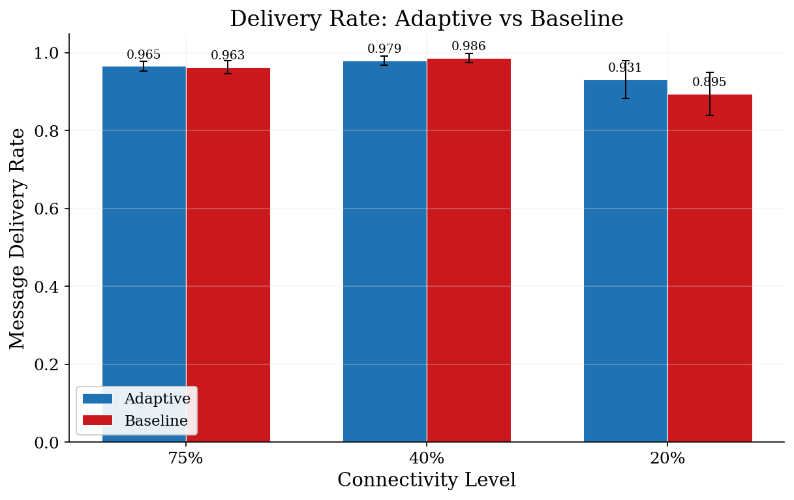
    


```python
# Figure 2: Assignment Rate — Grouped Bar Chart
fig = plot_grouped_bars(summaries["assignment_rate"], "assignment_rate")
save_figure(fig, "fig_assignment_rate_bars", FIGURES_DIR)
plt.show()
```


    
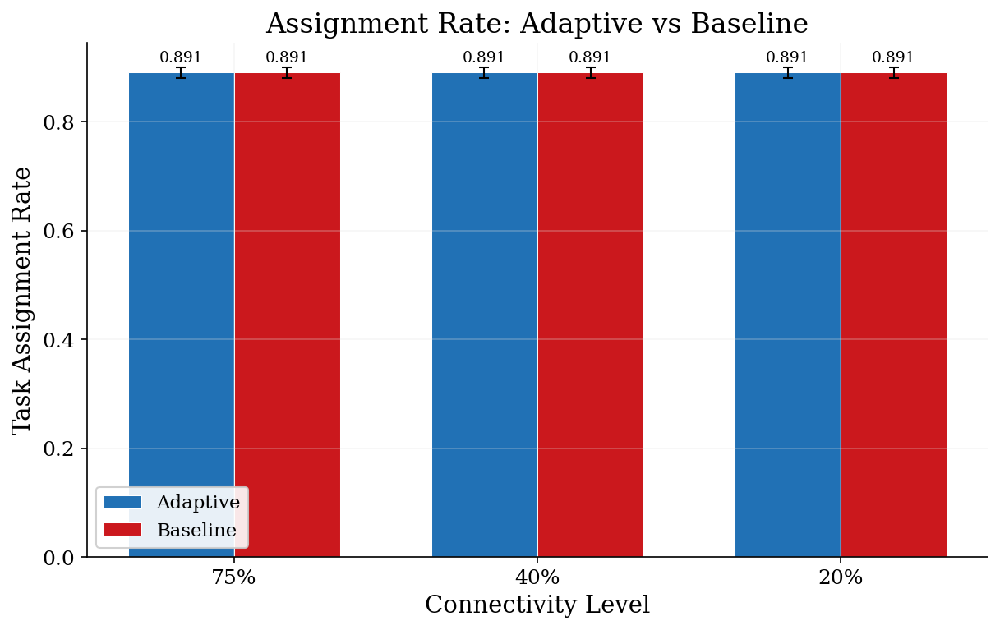
    


```python
# Figure 3: Response Time — Grouped Bar Chart
fig = plot_grouped_bars(summaries["avg_response_time"], "avg_response_time")
save_figure(fig, "fig_response_time_bars", FIGURES_DIR)
plt.show()
```


    
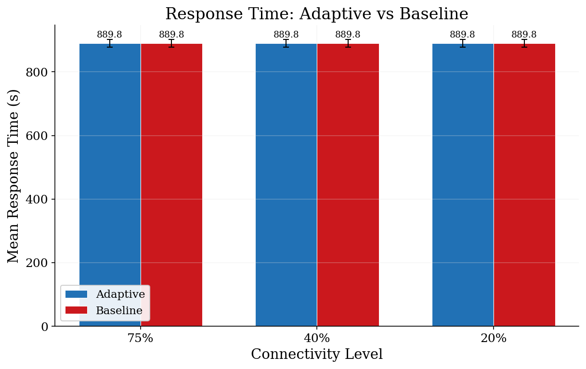
    


```python
# Figure 3b: Delivery Time — Grouped Bar Chart
if "avg_delivery_time" in summaries:
    fig = plot_grouped_bars(summaries["avg_delivery_time"], "avg_delivery_time")
    save_figure(fig, "fig_delivery_time_bars", FIGURES_DIR)
    plt.show()
else:
    print("avg_delivery_time not in summaries — check build_results_dataframe()")
```


    
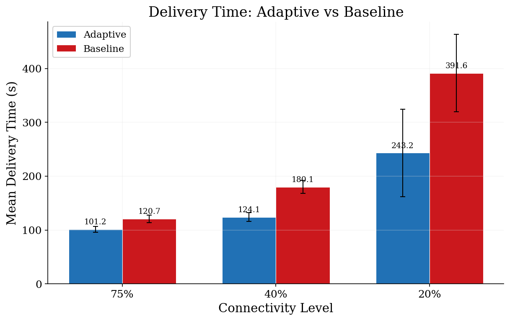
    


```python
# Figure 4: Box Plot Distributions
fig = plot_box_distributions(df)
save_figure(fig, "fig_box_distributions", FIGURES_DIR)
plt.show()
```


    
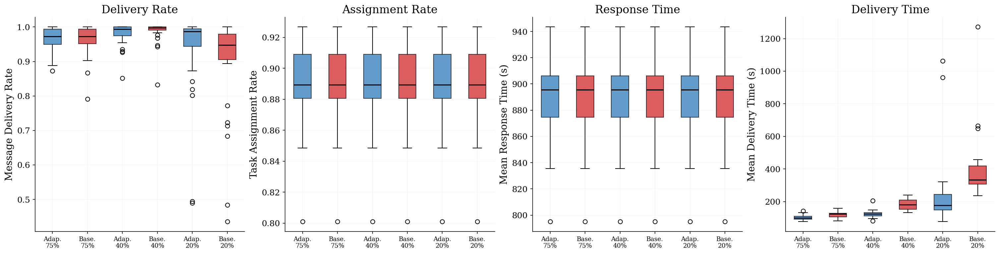
    


```python
# Figure 5: Performance Heatmap
fig = plot_heatmap(df)
save_figure(fig, "fig_heatmap", FIGURES_DIR)
plt.show()
```


    
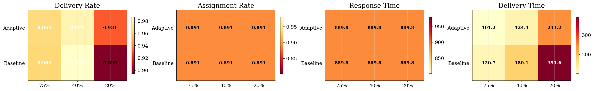
    


```python
# Figure 6: Connectivity Degradation Lines
fig = plot_degradation_lines(summaries)
save_figure(fig, "fig_degradation_lines", FIGURES_DIR)
plt.show()
```


    
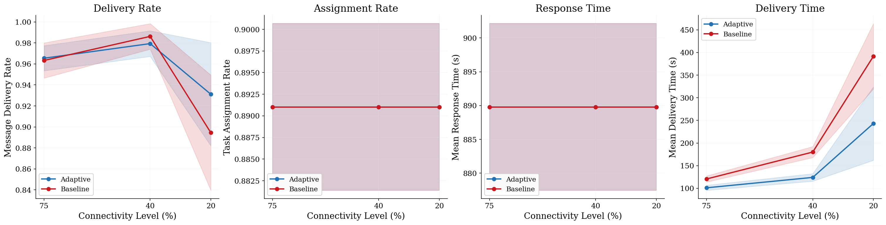
    


```python
# Summary of saved figures
figure_files = sorted(FIGURES_DIR.glob("fig_*.png"))
print(f"\nGenerated {len(figure_files)} figures in {FIGURES_DIR}:")
for f in figure_files:
    print(f"  {f.name}")
```

    
    Generated 17 figures in /Users/dianafonseca/resilient-emergency-response/outputs/figures:
      fig_assignment_rate_bars.png
      fig_box_distributions.png
      fig_degradation_lines.png
      fig_delivery_rate_bars.png
      fig_delivery_time_bars.png
      fig_heatmap.png
      fig_journey_adaptive.png
      fig_journey_baseline.png
      fig_paths_adaptive.png
      fig_paths_baseline.png
      fig_pred_evolution_adaptive.png
      fig_pred_evolution_baseline.png
      fig_pred_heatmap_adaptive.png
      fig_pred_heatmap_baseline.png
      fig_predictability_adaptive.png
      fig_predictability_baseline.png
      fig_response_time_bars.png


## 3b. Network Diagnostics

Visualizations of the PRoPHET routing protocol, message forwarding,
and node mobility — generated from a single representative simulation
at 20% connectivity (the most challenging scenario for the research question).


```python
from ercs.visualization.animation import run_paired_simulation
from ercs.visualization.diagnostics import (
    find_message_journeys,
    plot_all_message_paths,
    plot_message_journey,
    plot_predictability_evolution,
    plot_predictability_graph,
    plot_predictability_heatmap,
)

DIAG_CONNECTIVITY = 0.20  # Most interesting for research question
DIAG_SEED = 42
SAMPLE_INTERVAL = 30.0

print(f"Running paired simulation at {DIAG_CONNECTIVITY:.0%} connectivity...")
t0 = time.time()

adaptive_frames, baseline_frames, adaptive_fwd, baseline_fwd = run_paired_simulation(
    config=config,
    connectivity_level=DIAG_CONNECTIVITY,
    seed=DIAG_SEED,
    sample_interval=SAMPLE_INTERVAL,
)

elapsed = time.time() - t0
print(f"Done in {elapsed:.1f}s — {len(adaptive_frames)} frames captured per algorithm")
```

    Running paired simulation at 20% connectivity...
    Done in 21.8s — 200 frames captured per algorithm


```python
# Figure 7: PRoPHET Predictability Network at simulation midpoint
mid = len(adaptive_frames) // 2
print(f"Predictability graph at t={adaptive_frames[mid].timestamp:.0f}s\n")

for label, frames in [("Adaptive", adaptive_frames), ("Baseline", baseline_frames)]:
    fig = plot_predictability_graph(frames[mid], config, algorithm_label=label)
    save_figure(fig, f"fig_predictability_{label.lower()}", FIGURES_DIR)
    plt.show()
```

    Predictability graph at t=3001s
    


    

    


    
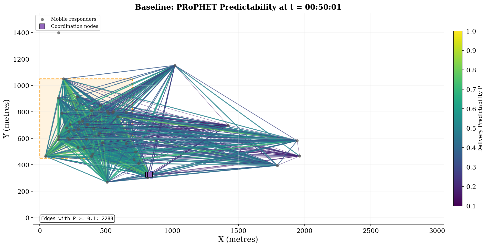
    


```python
# Figure 8: Predictability Heatmap (Coord → Mobile)
for label, frames in [("Adaptive", adaptive_frames), ("Baseline", baseline_frames)]:
    fig = plot_predictability_heatmap(frames[mid], algorithm_label=label)
    save_figure(fig, f"fig_pred_heatmap_{label.lower()}", FIGURES_DIR)
    plt.show()
```


    

    


    
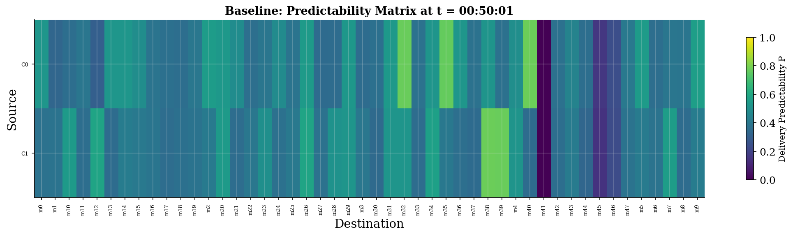
    


```python
# Figure 9: Predictability Evolution Over Time
for label, frames in [("Adaptive", adaptive_frames), ("Baseline", baseline_frames)]:
    fig = plot_predictability_evolution(frames, algorithm_label=label)
    save_figure(fig, f"fig_pred_evolution_{label.lower()}", FIGURES_DIR)
    plt.show()
```


    
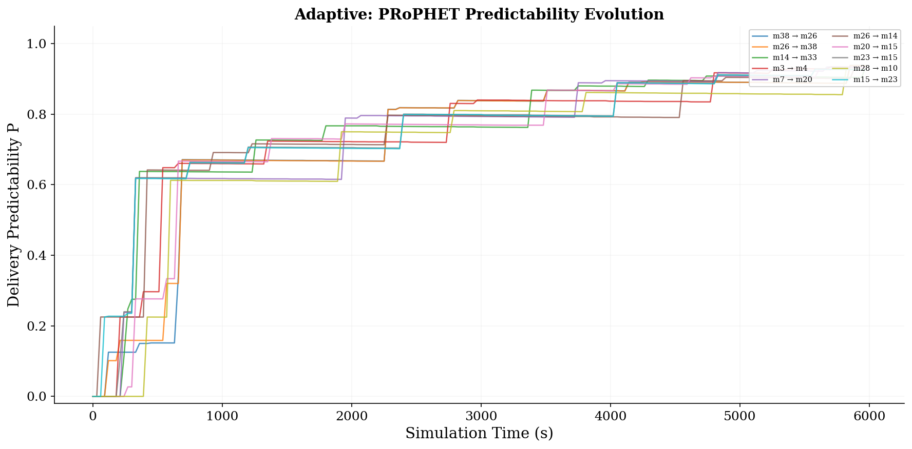
    


    

    


```python
# Figure 10: Message Journey (first forwarded message per algorithm)
for label, fwd_log, frames in [
    ("Adaptive", adaptive_fwd, adaptive_frames),
    ("Baseline", baseline_fwd, baseline_frames),
]:
    journeys = find_message_journeys(fwd_log)
    if not journeys:
        print(f"  {label}: no messages forwarded")
        continue

    msg_id = min(journeys.keys(), key=lambda m: journeys[m][0].timestamp)
    print(f"{label}: tracking message {msg_id[:16]}... ({len(journeys[msg_id])} hops)")

    fig = plot_message_journey(msg_id, journeys[msg_id], frames, config, algorithm_label=label)
    save_figure(fig, f"fig_journey_{label.lower()}", FIGURES_DIR)
    plt.show()
```

    Adaptive: tracking message 0d50555d-138a-40... (117 hops)


    
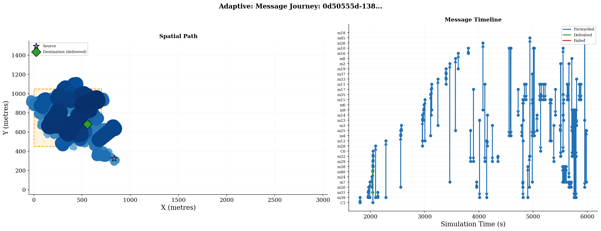
    


    Baseline: tracking message 288e9821-fbcd-4f... (347 hops)


    
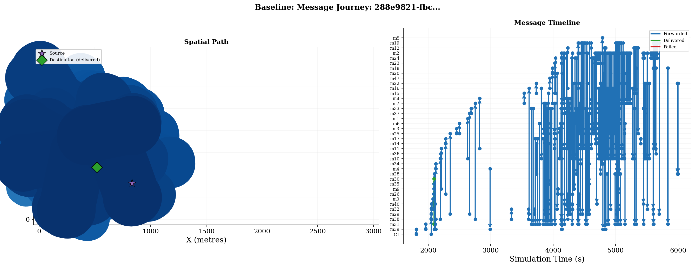
    


```python
# Figure 11: All Message Paths Overview
for label, frames, fwd_log in [
    ("Adaptive", adaptive_frames, adaptive_fwd),
    ("Baseline", baseline_frames, baseline_fwd),
]:
    fig = plot_all_message_paths(frames, fwd_log, config, algorithm_label=label)
    save_figure(fig, f"fig_paths_{label.lower()}", FIGURES_DIR)
    plt.show()

# Updated figure count
figure_files = sorted(FIGURES_DIR.glob("fig_*.png"))
print(f"\nTotal figures saved: {len(figure_files)} in {FIGURES_DIR}")
for f in figure_files:
    print(f"  {f.name}")
```


    
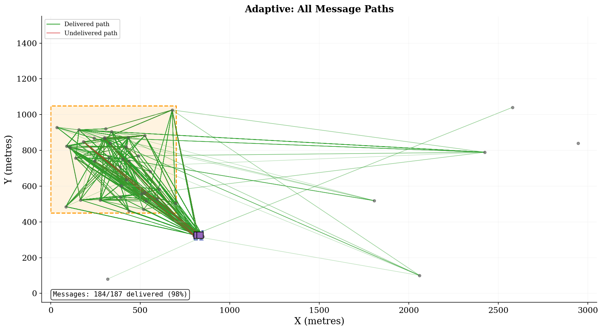
    


    
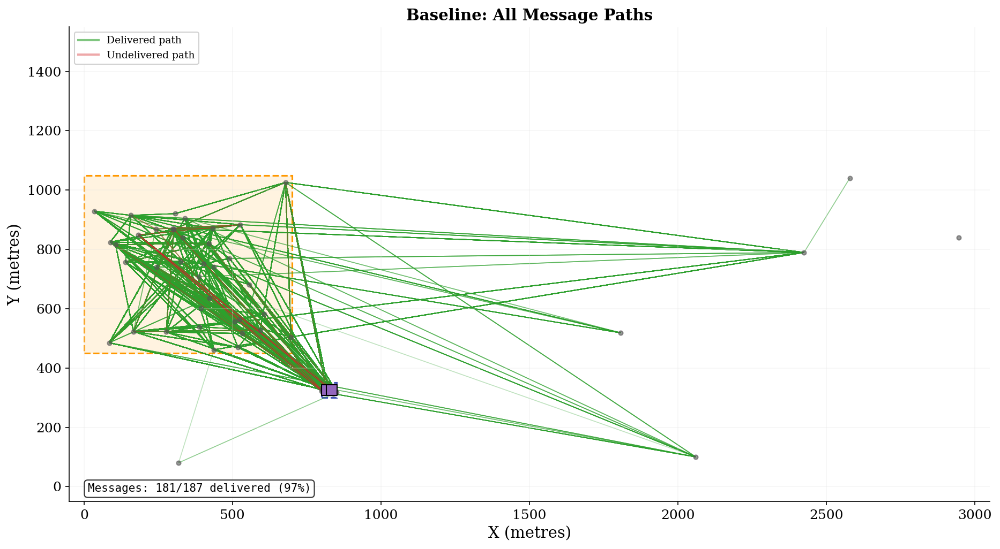
    


    
    Total figures saved: 17 in /Users/dianafonseca/resilient-emergency-response/outputs/figures
      fig_assignment_rate_bars.png
      fig_box_distributions.png
      fig_degradation_lines.png
      fig_delivery_rate_bars.png
      fig_delivery_time_bars.png
      fig_heatmap.png
      fig_journey_adaptive.png
      fig_journey_baseline.png
      fig_paths_adaptive.png
      fig_paths_baseline.png
      fig_pred_evolution_adaptive.png
      fig_pred_evolution_baseline.png
      fig_pred_heatmap_adaptive.png
      fig_pred_heatmap_baseline.png
      fig_predictability_adaptive.png
      fig_predictability_baseline.png
      fig_response_time_bars.png


## 4. Statistical Analysis

Comparing algorithms using Welch's t-test (per connectivity level) and
one-way ANOVA (across connectivity levels). Significance level: \u03b1 = 0.05.


```python
evaluator = PerformanceEvaluator(results)
report = evaluator.generate_report(
    metrics=[
        MetricType.DELIVERY_RATE,
        MetricType.ASSIGNMENT_RATE,
        MetricType.RESPONSE_TIME,
        MetricType.DELIVERY_TIME,
    ]
)
```


```python
# Table 1: Welch's t-test Results
ttest_df = build_ttest_table(report)
display(
    ttest_df.style
    .set_caption("Table 1: Welch's t-test Results (Adaptive vs Baseline)")
    .hide(axis="index")
    .map(lambda v: "font-weight: bold; background-color: #d4edda" if v == "Yes" else "", subset=["Sig."])
)
```


<style type="text/css">
#T_685f6_row12_col8, #T_685f6_row13_col8, #T_685f6_row14_col8, #T_685f6_row15_col8 {
  font-weight: bold;
  background-color: #d4edda;
}
</style>
<table id="T_685f6">
  <caption>Table 1: Welch's t-test Results (Adaptive vs Baseline)</caption>
  <thead>
    <tr>
      <th id="T_685f6_level0_col0" class="col_heading level0 col0" >Metric</th>
      <th id="T_685f6_level0_col1" class="col_heading level0 col1" >Connectivity</th>
      <th id="T_685f6_level0_col2" class="col_heading level0 col2" >Adaptive (mean ± std)</th>
      <th id="T_685f6_level0_col3" class="col_heading level0 col3" >Baseline (mean ± std)</th>
      <th id="T_685f6_level0_col4" class="col_heading level0 col4" >Improvement</th>
      <th id="T_685f6_level0_col5" class="col_heading level0 col5" >t</th>
      <th id="T_685f6_level0_col6" class="col_heading level0 col6" >p-value</th>
      <th id="T_685f6_level0_col7" class="col_heading level0 col7" >Cohen's d</th>
      <th id="T_685f6_level0_col8" class="col_heading level0 col8" >Sig.</th>
    </tr>
  </thead>
  <tbody>
    <tr>
      <td id="T_685f6_row0_col0" class="data row0 col0" >Delivery Rate</td>
      <td id="T_685f6_row0_col1" class="data row0 col1" >Overall</td>
      <td id="T_685f6_row0_col2" class="data row0 col2" >0.9586 ± 0.0821</td>
      <td id="T_685f6_row0_col3" class="data row0 col3" >0.9480 ± 0.0979</td>
      <td id="T_685f6_row0_col4" class="data row0 col4" >+1.12%</td>
      <td id="T_685f6_row0_col5" class="data row0 col5" >0.789</td>
      <td id="T_685f6_row0_col6" class="data row0 col6" >0.4314</td>
      <td id="T_685f6_row0_col7" class="data row0 col7" >0.118</td>
      <td id="T_685f6_row0_col8" class="data row0 col8" >No</td>
    </tr>
    <tr>
      <td id="T_685f6_row1_col0" class="data row1 col0" >Delivery Rate</td>
      <td id="T_685f6_row1_col1" class="data row1 col1" >20%</td>
      <td id="T_685f6_row1_col2" class="data row1 col2" >0.9311 ± 0.1316</td>
      <td id="T_685f6_row1_col3" class="data row1 col3" >0.8945 ± 0.1470</td>
      <td id="T_685f6_row1_col4" class="data row1 col4" >+4.09%</td>
      <td id="T_685f6_row1_col5" class="data row1 col5" >1.016</td>
      <td id="T_685f6_row1_col6" class="data row1 col6" >0.3140</td>
      <td id="T_685f6_row1_col7" class="data row1 col7" >0.262</td>
      <td id="T_685f6_row1_col8" class="data row1 col8" >No</td>
    </tr>
    <tr>
      <td id="T_685f6_row2_col0" class="data row2 col0" >Delivery Rate</td>
      <td id="T_685f6_row2_col1" class="data row2 col1" >40%</td>
      <td id="T_685f6_row2_col2" class="data row2 col2" >0.9793 ± 0.0327</td>
      <td id="T_685f6_row2_col3" class="data row2 col3" >0.9862 ± 0.0326</td>
      <td id="T_685f6_row2_col4" class="data row2 col4" >-0.70%</td>
      <td id="T_685f6_row2_col5" class="data row2 col5" >-0.815</td>
      <td id="T_685f6_row2_col6" class="data row2 col6" >0.4187</td>
      <td id="T_685f6_row2_col7" class="data row2 col7" >-0.210</td>
      <td id="T_685f6_row2_col8" class="data row2 col8" >No</td>
    </tr>
    <tr>
      <td id="T_685f6_row3_col0" class="data row3 col0" >Delivery Rate</td>
      <td id="T_685f6_row3_col1" class="data row3 col1" >75%</td>
      <td id="T_685f6_row3_col2" class="data row3 col2" >0.9654 ± 0.0321</td>
      <td id="T_685f6_row3_col3" class="data row3 col3" >0.9633 ± 0.0449</td>
      <td id="T_685f6_row3_col4" class="data row3 col4" >+0.22%</td>
      <td id="T_685f6_row3_col5" class="data row3 col5" >0.212</td>
      <td id="T_685f6_row3_col6" class="data row3 col6" >0.8326</td>
      <td id="T_685f6_row3_col7" class="data row3 col7" >0.055</td>
      <td id="T_685f6_row3_col8" class="data row3 col8" >No</td>
    </tr>
    <tr>
      <td id="T_685f6_row4_col0" class="data row4 col0" >Assignment Rate</td>
      <td id="T_685f6_row4_col1" class="data row4 col1" >Overall</td>
      <td id="T_685f6_row4_col2" class="data row4 col2" >0.8910 ± 0.0255</td>
      <td id="T_685f6_row4_col3" class="data row4 col3" >0.8910 ± 0.0255</td>
      <td id="T_685f6_row4_col4" class="data row4 col4" >+0.00%</td>
      <td id="T_685f6_row4_col5" class="data row4 col5" >0.000</td>
      <td id="T_685f6_row4_col6" class="data row4 col6" >1.0000</td>
      <td id="T_685f6_row4_col7" class="data row4 col7" >0.000</td>
      <td id="T_685f6_row4_col8" class="data row4 col8" >No</td>
    </tr>
    <tr>
      <td id="T_685f6_row5_col0" class="data row5 col0" >Assignment Rate</td>
      <td id="T_685f6_row5_col1" class="data row5 col1" >20%</td>
      <td id="T_685f6_row5_col2" class="data row5 col2" >0.8910 ± 0.0258</td>
      <td id="T_685f6_row5_col3" class="data row5 col3" >0.8910 ± 0.0258</td>
      <td id="T_685f6_row5_col4" class="data row5 col4" >+0.00%</td>
      <td id="T_685f6_row5_col5" class="data row5 col5" >0.000</td>
      <td id="T_685f6_row5_col6" class="data row5 col6" >1.0000</td>
      <td id="T_685f6_row5_col7" class="data row5 col7" >0.000</td>
      <td id="T_685f6_row5_col8" class="data row5 col8" >No</td>
    </tr>
    <tr>
      <td id="T_685f6_row6_col0" class="data row6 col0" >Assignment Rate</td>
      <td id="T_685f6_row6_col1" class="data row6 col1" >40%</td>
      <td id="T_685f6_row6_col2" class="data row6 col2" >0.8910 ± 0.0258</td>
      <td id="T_685f6_row6_col3" class="data row6 col3" >0.8910 ± 0.0258</td>
      <td id="T_685f6_row6_col4" class="data row6 col4" >+0.00%</td>
      <td id="T_685f6_row6_col5" class="data row6 col5" >0.000</td>
      <td id="T_685f6_row6_col6" class="data row6 col6" >1.0000</td>
      <td id="T_685f6_row6_col7" class="data row6 col7" >0.000</td>
      <td id="T_685f6_row6_col8" class="data row6 col8" >No</td>
    </tr>
    <tr>
      <td id="T_685f6_row7_col0" class="data row7 col0" >Assignment Rate</td>
      <td id="T_685f6_row7_col1" class="data row7 col1" >75%</td>
      <td id="T_685f6_row7_col2" class="data row7 col2" >0.8910 ± 0.0258</td>
      <td id="T_685f6_row7_col3" class="data row7 col3" >0.8910 ± 0.0258</td>
      <td id="T_685f6_row7_col4" class="data row7 col4" >+0.00%</td>
      <td id="T_685f6_row7_col5" class="data row7 col5" >0.000</td>
      <td id="T_685f6_row7_col6" class="data row7 col6" >1.0000</td>
      <td id="T_685f6_row7_col7" class="data row7 col7" >0.000</td>
      <td id="T_685f6_row7_col8" class="data row7 col8" >No</td>
    </tr>
    <tr>
      <td id="T_685f6_row8_col0" class="data row8 col0" >Response Time</td>
      <td id="T_685f6_row8_col1" class="data row8 col1" >Overall</td>
      <td id="T_685f6_row8_col2" class="data row8 col2" >889.7913 ± 32.6440</td>
      <td id="T_685f6_row8_col3" class="data row8 col3" >889.7913 ± 32.6440</td>
      <td id="T_685f6_row8_col4" class="data row8 col4" >+0.00%</td>
      <td id="T_685f6_row8_col5" class="data row8 col5" >0.000</td>
      <td id="T_685f6_row8_col6" class="data row8 col6" >1.0000</td>
      <td id="T_685f6_row8_col7" class="data row8 col7" >0.000</td>
      <td id="T_685f6_row8_col8" class="data row8 col8" >No</td>
    </tr>
    <tr>
      <td id="T_685f6_row9_col0" class="data row9 col0" >Response Time</td>
      <td id="T_685f6_row9_col1" class="data row9 col1" >20%</td>
      <td id="T_685f6_row9_col2" class="data row9 col2" >889.7913 ± 33.0171</td>
      <td id="T_685f6_row9_col3" class="data row9 col3" >889.7913 ± 33.0171</td>
      <td id="T_685f6_row9_col4" class="data row9 col4" >+0.00%</td>
      <td id="T_685f6_row9_col5" class="data row9 col5" >0.000</td>
      <td id="T_685f6_row9_col6" class="data row9 col6" >1.0000</td>
      <td id="T_685f6_row9_col7" class="data row9 col7" >0.000</td>
      <td id="T_685f6_row9_col8" class="data row9 col8" >No</td>
    </tr>
    <tr>
      <td id="T_685f6_row10_col0" class="data row10 col0" >Response Time</td>
      <td id="T_685f6_row10_col1" class="data row10 col1" >40%</td>
      <td id="T_685f6_row10_col2" class="data row10 col2" >889.7913 ± 33.0171</td>
      <td id="T_685f6_row10_col3" class="data row10 col3" >889.7913 ± 33.0171</td>
      <td id="T_685f6_row10_col4" class="data row10 col4" >+0.00%</td>
      <td id="T_685f6_row10_col5" class="data row10 col5" >0.000</td>
      <td id="T_685f6_row10_col6" class="data row10 col6" >1.0000</td>
      <td id="T_685f6_row10_col7" class="data row10 col7" >0.000</td>
      <td id="T_685f6_row10_col8" class="data row10 col8" >No</td>
    </tr>
    <tr>
      <td id="T_685f6_row11_col0" class="data row11 col0" >Response Time</td>
      <td id="T_685f6_row11_col1" class="data row11 col1" >75%</td>
      <td id="T_685f6_row11_col2" class="data row11 col2" >889.7913 ± 33.0171</td>
      <td id="T_685f6_row11_col3" class="data row11 col3" >889.7913 ± 33.0171</td>
      <td id="T_685f6_row11_col4" class="data row11 col4" >+0.00%</td>
      <td id="T_685f6_row11_col5" class="data row11 col5" >0.000</td>
      <td id="T_685f6_row11_col6" class="data row11 col6" >1.0000</td>
      <td id="T_685f6_row11_col7" class="data row11 col7" >0.000</td>
      <td id="T_685f6_row11_col8" class="data row11 col8" >No</td>
    </tr>
    <tr>
      <td id="T_685f6_row12_col0" class="data row12 col0" >Delivery Time</td>
      <td id="T_685f6_row12_col1" class="data row12 col1" >Overall</td>
      <td id="T_685f6_row12_col2" class="data row12 col2" >156.1540 ± 139.9364</td>
      <td id="T_685f6_row12_col3" class="data row12 col3" >230.8085 ± 162.1372</td>
      <td id="T_685f6_row12_col4" class="data row12 col4" >-32.34%</td>
      <td id="T_685f6_row12_col5" class="data row12 col5" >-3.307</td>
      <td id="T_685f6_row12_col6" class="data row12 col6" >0.0011</td>
      <td id="T_685f6_row12_col7" class="data row12 col7" >-0.493</td>
      <td id="T_685f6_row12_col8" class="data row12 col8" >Yes</td>
    </tr>
    <tr>
      <td id="T_685f6_row13_col0" class="data row13 col0" >Delivery Time</td>
      <td id="T_685f6_row13_col1" class="data row13 col1" >20%</td>
      <td id="T_685f6_row13_col2" class="data row13 col2" >243.1680 ± 217.5893</td>
      <td id="T_685f6_row13_col3" class="data row13 col3" >391.6147 ± 193.2092</td>
      <td id="T_685f6_row13_col4" class="data row13 col4" >-37.91%</td>
      <td id="T_685f6_row13_col5" class="data row13 col5" >-2.794</td>
      <td id="T_685f6_row13_col6" class="data row13 col6" >0.0071</td>
      <td id="T_685f6_row13_col7" class="data row13 col7" >-0.721</td>
      <td id="T_685f6_row13_col8" class="data row13 col8" >Yes</td>
    </tr>
    <tr>
      <td id="T_685f6_row14_col0" class="data row14 col0" >Delivery Time</td>
      <td id="T_685f6_row14_col1" class="data row14 col1" >40%</td>
      <td id="T_685f6_row14_col2" class="data row14 col2" >124.1114 ± 22.4096</td>
      <td id="T_685f6_row14_col3" class="data row14 col3" >180.1074 ± 32.7095</td>
      <td id="T_685f6_row14_col4" class="data row14 col4" >-31.09%</td>
      <td id="T_685f6_row14_col5" class="data row14 col5" >-7.735</td>
      <td id="T_685f6_row14_col6" class="data row14 col6" >0.0000</td>
      <td id="T_685f6_row14_col7" class="data row14 col7" >-1.997</td>
      <td id="T_685f6_row14_col8" class="data row14 col8" >Yes</td>
    </tr>
    <tr>
      <td id="T_685f6_row15_col0" class="data row15 col0" >Delivery Time</td>
      <td id="T_685f6_row15_col1" class="data row15 col1" >75%</td>
      <td id="T_685f6_row15_col2" class="data row15 col2" >101.1826 ± 15.1359</td>
      <td id="T_685f6_row15_col3" class="data row15 col3" >120.7034 ± 18.1102</td>
      <td id="T_685f6_row15_col4" class="data row15 col4" >-16.17%</td>
      <td id="T_685f6_row15_col5" class="data row15 col5" >-4.530</td>
      <td id="T_685f6_row15_col6" class="data row15 col6" >0.0000</td>
      <td id="T_685f6_row15_col7" class="data row15 col7" >-1.170</td>
      <td id="T_685f6_row15_col8" class="data row15 col8" >Yes</td>
    </tr>
  </tbody>
</table>


```python
# Table 2: ANOVA Results
anova_df = build_anova_table(report)
display(
    anova_df.style
    .set_caption("Table 2: One-way ANOVA Results (Effect of Connectivity)")
    .hide(axis="index")
    .map(lambda v: "font-weight: bold; background-color: #d4edda" if v == "Yes" else "", subset=["Sig."])
)
```


<style type="text/css">
#T_4cb33_row1_col7, #T_4cb33_row6_col7, #T_4cb33_row7_col7 {
  font-weight: bold;
  background-color: #d4edda;
}
</style>
<table id="T_4cb33">
  <caption>Table 2: One-way ANOVA Results (Effect of Connectivity)</caption>
  <thead>
    <tr>
      <th id="T_4cb33_level0_col0" class="col_heading level0 col0" >Metric</th>
      <th id="T_4cb33_level0_col1" class="col_heading level0 col1" >Algorithm</th>
      <th id="T_4cb33_level0_col2" class="col_heading level0 col2" >F</th>
      <th id="T_4cb33_level0_col3" class="col_heading level0 col3" >p-value</th>
      <th id="T_4cb33_level0_col4" class="col_heading level0 col4" >df</th>
      <th id="T_4cb33_level0_col5" class="col_heading level0 col5" >η²</th>
      <th id="T_4cb33_level0_col6" class="col_heading level0 col6" >Effect</th>
      <th id="T_4cb33_level0_col7" class="col_heading level0 col7" >Sig.</th>
    </tr>
  </thead>
  <tbody>
    <tr>
      <td id="T_4cb33_row0_col0" class="data row0 col0" >Delivery Rate</td>
      <td id="T_4cb33_row0_col1" class="data row0 col1" >Adaptive</td>
      <td id="T_4cb33_row0_col2" class="data row0 col2" >2.855</td>
      <td id="T_4cb33_row0_col3" class="data row0 col3" >0.0630</td>
      <td id="T_4cb33_row0_col4" class="data row0 col4" >(2, 87)</td>
      <td id="T_4cb33_row0_col5" class="data row0 col5" >0.062</td>
      <td id="T_4cb33_row0_col6" class="data row0 col6" >medium</td>
      <td id="T_4cb33_row0_col7" class="data row0 col7" >No</td>
    </tr>
    <tr>
      <td id="T_4cb33_row1_col0" class="data row1 col0" >Delivery Rate</td>
      <td id="T_4cb33_row1_col1" class="data row1 col1" >Baseline</td>
      <td id="T_4cb33_row1_col2" class="data row1 col2" >8.300</td>
      <td id="T_4cb33_row1_col3" class="data row1 col3" >0.0005</td>
      <td id="T_4cb33_row1_col4" class="data row1 col4" >(2, 87)</td>
      <td id="T_4cb33_row1_col5" class="data row1 col5" >0.160</td>
      <td id="T_4cb33_row1_col6" class="data row1 col6" >large</td>
      <td id="T_4cb33_row1_col7" class="data row1 col7" >Yes</td>
    </tr>
    <tr>
      <td id="T_4cb33_row2_col0" class="data row2 col0" >Assignment Rate</td>
      <td id="T_4cb33_row2_col1" class="data row2 col1" >Adaptive</td>
      <td id="T_4cb33_row2_col2" class="data row2 col2" >0.000</td>
      <td id="T_4cb33_row2_col3" class="data row2 col3" >1.0000</td>
      <td id="T_4cb33_row2_col4" class="data row2 col4" >(2, 87)</td>
      <td id="T_4cb33_row2_col5" class="data row2 col5" >0.000</td>
      <td id="T_4cb33_row2_col6" class="data row2 col6" >negligible</td>
      <td id="T_4cb33_row2_col7" class="data row2 col7" >No</td>
    </tr>
    <tr>
      <td id="T_4cb33_row3_col0" class="data row3 col0" >Assignment Rate</td>
      <td id="T_4cb33_row3_col1" class="data row3 col1" >Baseline</td>
      <td id="T_4cb33_row3_col2" class="data row3 col2" >0.000</td>
      <td id="T_4cb33_row3_col3" class="data row3 col3" >1.0000</td>
      <td id="T_4cb33_row3_col4" class="data row3 col4" >(2, 87)</td>
      <td id="T_4cb33_row3_col5" class="data row3 col5" >0.000</td>
      <td id="T_4cb33_row3_col6" class="data row3 col6" >negligible</td>
      <td id="T_4cb33_row3_col7" class="data row3 col7" >No</td>
    </tr>
    <tr>
      <td id="T_4cb33_row4_col0" class="data row4 col0" >Response Time</td>
      <td id="T_4cb33_row4_col1" class="data row4 col1" >Adaptive</td>
      <td id="T_4cb33_row4_col2" class="data row4 col2" >0.000</td>
      <td id="T_4cb33_row4_col3" class="data row4 col3" >1.0000</td>
      <td id="T_4cb33_row4_col4" class="data row4 col4" >(2, 87)</td>
      <td id="T_4cb33_row4_col5" class="data row4 col5" >0.000</td>
      <td id="T_4cb33_row4_col6" class="data row4 col6" >negligible</td>
      <td id="T_4cb33_row4_col7" class="data row4 col7" >No</td>
    </tr>
    <tr>
      <td id="T_4cb33_row5_col0" class="data row5 col0" >Response Time</td>
      <td id="T_4cb33_row5_col1" class="data row5 col1" >Baseline</td>
      <td id="T_4cb33_row5_col2" class="data row5 col2" >0.000</td>
      <td id="T_4cb33_row5_col3" class="data row5 col3" >1.0000</td>
      <td id="T_4cb33_row5_col4" class="data row5 col4" >(2, 87)</td>
      <td id="T_4cb33_row5_col5" class="data row5 col5" >0.000</td>
      <td id="T_4cb33_row5_col6" class="data row5 col6" >negligible</td>
      <td id="T_4cb33_row5_col7" class="data row5 col7" >No</td>
    </tr>
    <tr>
      <td id="T_4cb33_row6_col0" class="data row6 col0" >Delivery Time</td>
      <td id="T_4cb33_row6_col1" class="data row6 col1" >Adaptive</td>
      <td id="T_4cb33_row6_col2" class="data row6 col2" >10.876</td>
      <td id="T_4cb33_row6_col3" class="data row6 col3" >0.0001</td>
      <td id="T_4cb33_row6_col4" class="data row6 col4" >(2, 87)</td>
      <td id="T_4cb33_row6_col5" class="data row6 col5" >0.200</td>
      <td id="T_4cb33_row6_col6" class="data row6 col6" >large</td>
      <td id="T_4cb33_row6_col7" class="data row6 col7" >Yes</td>
    </tr>
    <tr>
      <td id="T_4cb33_row7_col0" class="data row7 col0" >Delivery Time</td>
      <td id="T_4cb33_row7_col1" class="data row7 col1" >Baseline</td>
      <td id="T_4cb33_row7_col2" class="data row7 col2" >47.120</td>
      <td id="T_4cb33_row7_col3" class="data row7 col3" >0.0000</td>
      <td id="T_4cb33_row7_col4" class="data row7 col4" >(2, 87)</td>
      <td id="T_4cb33_row7_col5" class="data row7 col5" >0.520</td>
      <td id="T_4cb33_row7_col6" class="data row7 col6" >large</td>
      <td id="T_4cb33_row7_col7" class="data row7 col7" >Yes</td>
    </tr>
  </tbody>
</table>


```python
# Effect Size Interpretation
print("Effect Size Interpretation")
print("=" * 65)
for comp in report.comparisons:
    d = abs(comp.ttest.cohens_d)
    if d < 0.2:
        size = "negligible"
    elif d < 0.5:
        size = "small"
    elif d < 0.8:
        size = "medium"
    else:
        size = "large"
    if comp.connectivity_level is not None:
        label = f"{comp.metric.value} @ {comp.connectivity_level * 100:.0f}%"
    else:
        label = f"{comp.metric.value} (overall)"
    sig = "*" if comp.ttest.significant else ""
    print(f"  {label:40s}  d = {comp.ttest.cohens_d:+.3f} ({size}){sig}")
```

    Effect Size Interpretation
    =================================================================
      delivery_rate (overall)                   d = +0.118 (negligible)
      delivery_rate @ 20%                       d = +0.262 (small)
      delivery_rate @ 40%                       d = -0.210 (small)
      delivery_rate @ 75%                       d = +0.055 (negligible)
      assignment_rate (overall)                 d = +0.000 (negligible)
      assignment_rate @ 20%                     d = +0.000 (negligible)
      assignment_rate @ 40%                     d = +0.000 (negligible)
      assignment_rate @ 75%                     d = +0.000 (negligible)
      response_time (overall)                   d = +0.000 (negligible)
      response_time @ 20%                       d = +0.000 (negligible)
      response_time @ 40%                       d = +0.000 (negligible)
      response_time @ 75%                       d = +0.000 (negligible)
      delivery_time (overall)                   d = -0.493 (small)*
      delivery_time @ 20%                       d = -0.721 (medium)*
      delivery_time @ 40%                       d = -1.997 (large)*
      delivery_time @ 75%                       d = -1.170 (large)*


```python
# Delivery Time — dedicated summary table
print("\n=== DELIVERY TIME: Adaptive vs Baseline ===")
print(f"{'Connectivity':>14} {'Adaptive':>12} {'Baseline':>12} "
      f"{'Diff%':>8} {'Cohen d':>9} {'p-value':>9}")
print("-" * 70)
for conn in [0.75, 0.40, 0.20]:
    comp = next((c for c in report.comparisons
                 if c.metric == MetricType.DELIVERY_TIME
                 and c.connectivity_level == conn), None)
    if comp and comp.ttest:
        a_mean = comp.adaptive_stats.mean
        b_mean = comp.baseline_stats.mean
        diff_pct = (a_mean - b_mean) / b_mean * 100 if b_mean else 0
        print(f"{int(conn*100):>13}%  "
              f"{a_mean:>10.1f}s  {b_mean:>10.1f}s  "
              f"{diff_pct:>+7.1f}%  "
              f"{comp.ttest.cohens_d:>+9.3f}  "
              f"{comp.ttest.p_value:>9.4f}"
              + (" *" if comp.ttest.significant else ""))
print("-" * 70)
print("* p < 0.05")
```

    
    === DELIVERY TIME: Adaptive vs Baseline ===
      Connectivity     Adaptive     Baseline    Diff%   Cohen d   p-value
    ----------------------------------------------------------------------
               75%       101.2s       120.7s    -16.2%     -1.170     0.0000 *
               40%       124.1s       180.1s    -31.1%     -1.997     0.0000 *
               20%       243.2s       391.6s    -37.9%     -0.721     0.0071 *
    ----------------------------------------------------------------------
    * p < 0.05


## 5. Key Findings


```python
print("KEY FINDINGS")
print("=" * 60)

# 1. Overall delivery rate
overall_dr = next(
    (c for c in report.comparisons
     if c.metric == MetricType.DELIVERY_RATE and c.connectivity_level is None),
    None,
)
if overall_dr:
    print(f"\n1. DELIVERY RATE (Overall)")
    print(f"   Adaptive: {overall_dr.adaptive_stats.mean:.4f} +/- {overall_dr.adaptive_stats.std:.4f}")
    print(f"   Baseline: {overall_dr.baseline_stats.mean:.4f} +/- {overall_dr.baseline_stats.std:.4f}")
    print(f"   Improvement: {overall_dr.improvement:+.2f}%")
    print(f"   Significant: {'Yes' if overall_dr.ttest.significant else 'No'} (p={overall_dr.ttest.p_value:.4f})")

# 2. Where advantage is largest
per_conn = [
    c for c in report.comparisons
    if c.metric == MetricType.DELIVERY_RATE and c.connectivity_level is not None
]
if per_conn:
    best = max(per_conn, key=lambda c: c.improvement)
    print(f"\n2. LARGEST ADAPTIVE ADVANTAGE")
    print(f"   At {best.connectivity_level * 100:.0f}% connectivity: {best.improvement:+.2f}% improvement")

# 3. Connectivity effect
print(f"\n3. CONNECTIVITY EFFECT (ANOVA)")
for key, anova in report.anova_results.items():
    parts = key.rsplit("_", 1)
    metric_name = parts[0].replace("_", " ").title()
    algorithm = parts[1].capitalize() if len(parts) > 1 else "All"
    print(
        f"   {metric_name} ({algorithm}): "
        f"F({anova.df_between},{anova.df_within}) = {anova.f_statistic:.3f}, "
        f"p = {anova.p_value:.4f}, \u03b7\u00b2 = {anova.eta_squared:.3f}"
    )

print("\n" + "=" * 60)
print(f"Experiment complete. All figures saved to: {FIGURES_DIR}")
```

    KEY FINDINGS
    ============================================================
    
    1. DELIVERY RATE (Overall)
       Adaptive: 0.9586 +/- 0.0821
       Baseline: 0.9480 +/- 0.0979
       Improvement: +1.12%
       Significant: No (p=0.4314)
    
    2. LARGEST ADAPTIVE ADVANTAGE
       At 20% connectivity: +4.09% improvement
    
    3. CONNECTIVITY EFFECT (ANOVA)
       Delivery Rate (Adaptive): F(2,87) = 2.855, p = 0.0630, η² = 0.062
       Delivery Rate (Baseline): F(2,87) = 8.300, p = 0.0005, η² = 0.160
       Assignment Rate (Adaptive): F(2,87) = 0.000, p = 1.0000, η² = 0.000
       Assignment Rate (Baseline): F(2,87) = 0.000, p = 1.0000, η² = 0.000
       Response Time (Adaptive): F(2,87) = 0.000, p = 1.0000, η² = 0.000
       Response Time (Baseline): F(2,87) = 0.000, p = 1.0000, η² = 0.000
       Delivery Time (Adaptive): F(2,87) = 10.876, p = 0.0001, η² = 0.200
       Delivery Time (Baseline): F(2,87) = 47.120, p = 0.0000, η² = 0.520
    
    ============================================================
    Experiment complete. All figures saved to: /Users/dianafonseca/resilient-emergency-response/outputs/figures

